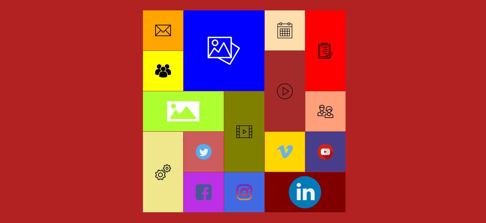

# Ui-Component-Metro-Tiles-Menu
##A look of Windows 8/10 Metro Tiles Menu made with pure HTML5 & CSS 

This Tile Menu can be used (as pe your need) as a sidebar drop down menu, responsive menu or a section.
Icons can be replaceable.

----------------------------------------------------------------
**TRY IT NOW**: [Metro Tiles Menu](https://arslanameer.github.io/Ui-Component-Metro-Tiles-Menu/)

**NOTE** Just a work Demo!

_(Arslan Ameer)_
